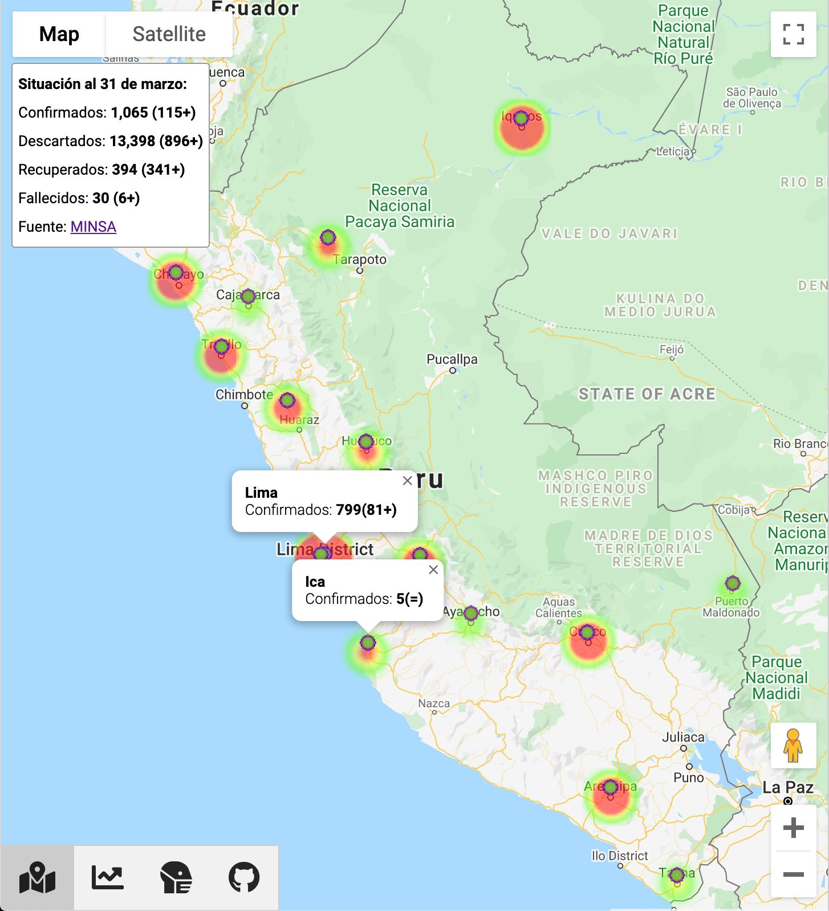
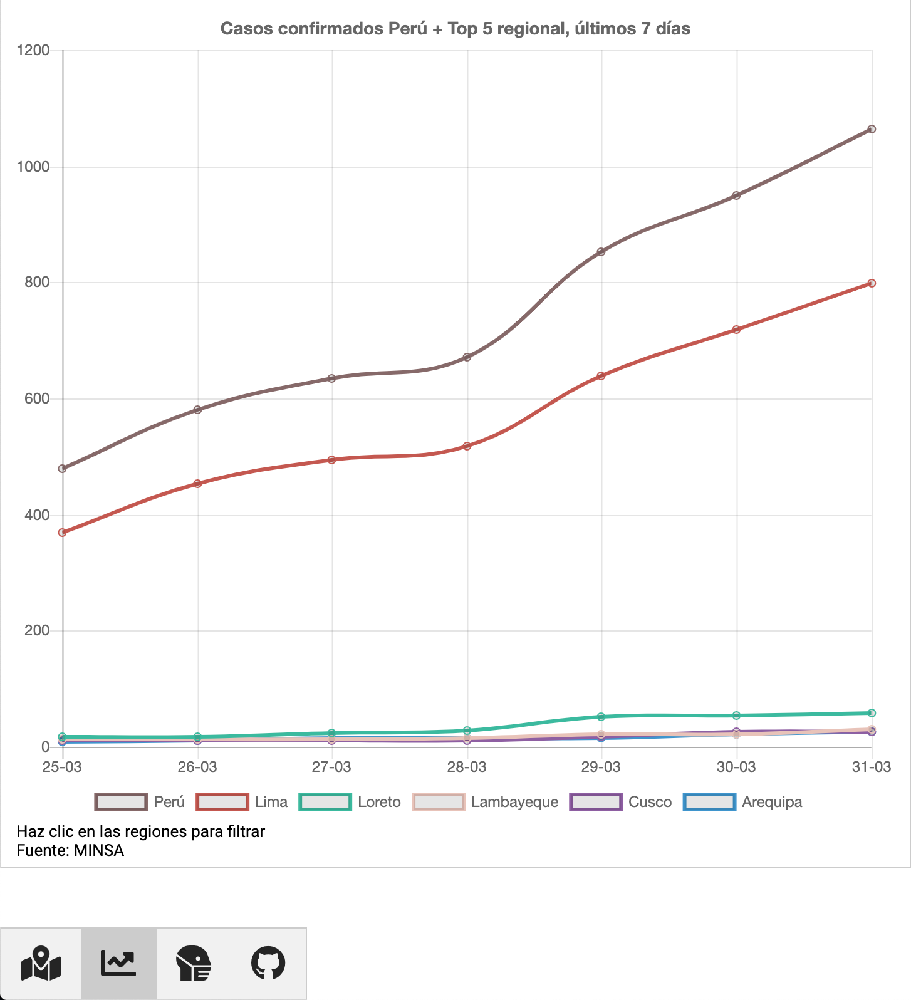
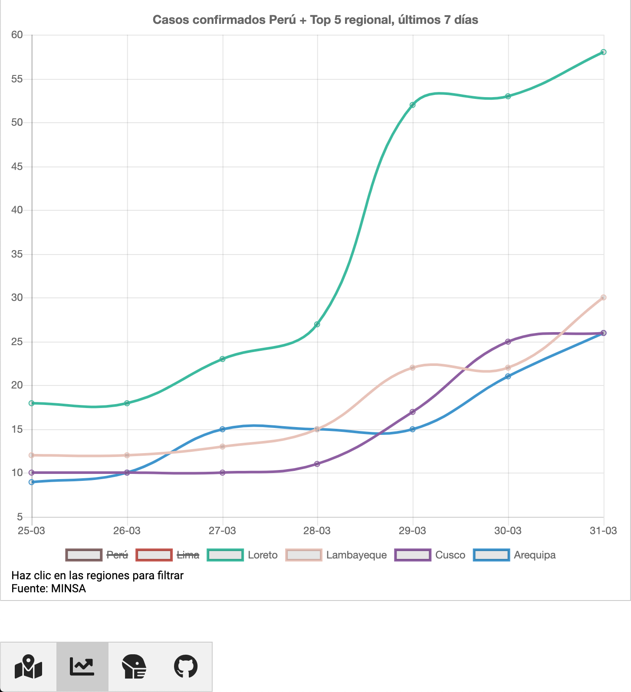
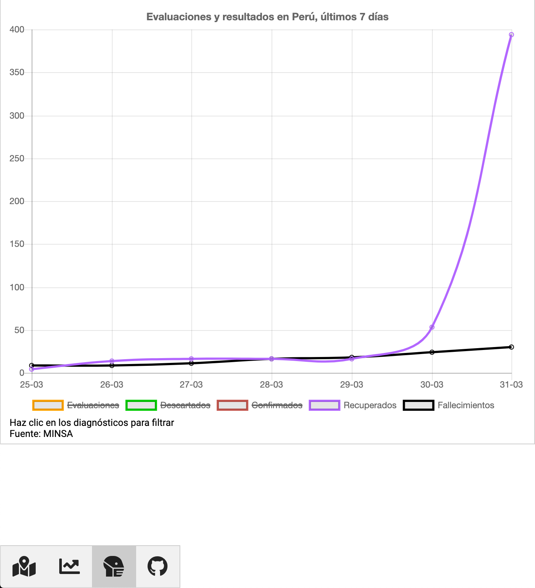

# Situación COVID-19 en Perú
Puedes ver la aplicación wen en este [enlace](https://jersson.github.io/covid19/)

---

# Funcionalidades
## Mapa de calor 
El mapa muestra los casos reportados por región incluyendo la variación de casos al día anterior.

## Top 5 regional de casos confirmados
El gráfico muestra la tendencia de los últimos 7 días. Además incluye la tendencia en el país y soporta filtros por cada zona geográfica.

## Evaluaciones y resultados
El gráfico muestra la relación y tendencia de evaluaciones, casos confirmados, casos descartados y fallecimientos.  

# Arquitectura
## Front End
Estoy usando [Github Pages](https://pages.github.com/) para publicar el código HTML y el mapa de calor de [Google Maps](https://developers.google.com/maps/documentation/javascript/examples/layer-heatmap) para mostrar la información de casos COVID-19 confirmados.

## Back End
Estoy usando [Google Cloud Functions](https://cloud.google.com/functions/docs/writing/http)

## Fuentes de información
La información es actualizada diariamente usando los reportes del [MINSA](https://www.gob.pe/minsa/) 

## Código fuente
Pueden encontrarlo en este [repositorio](./covid19)

# Información de contacto
Si tienen algún comentario o sugerencia, pueden contactarme por medio de [la sección de issues](https://github.com/jersson/jersson.github.io/issues), twitter ([@jersson](https://twitter/jersson)) o el [formulario de contacto en mi blog](https://jersson.net/contact/).

Espero que me ayuden a mejorar esta idea :)  
Un abrazo,  JD